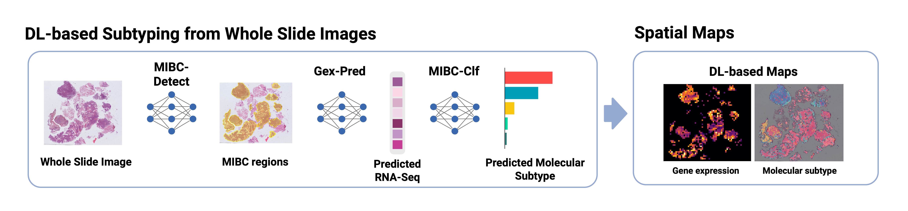

# MIBC_Subtyping

Inference pipeline for molecular subtyping of muscle-invasive bladder cancer (MIBC) from H&E whole-slide images. Predicts [consensus molecular subtypes](https://pubmed.ncbi.nlm.nih.gov/31563503/) (Ba/Sq, LumU, LumP, LumNS, Stroma-rich) directly from histology.

Preprint: https://www.biorxiv.org/content/10.1101/2025.10.23.684013v1



## Overview

Three steps:

1. **Encode slides** with [H-optimus-1](https://huggingface.co/bioptimus/H-optimus-1)
2. **Slide-level prediction** — subtype probabilities + predicted gene expression
3. **Generate spatial maps** (per-tile subtype classification + gene expression heatmaps)

## Installation

### 1. Install uv

```bash
curl -LsSf https://astral.sh/uv/install.sh | sh
# or on macOS
brew install uv
```

### 2. Create a virtual environment

```bash
uv venv --python 3.10
```

### 3. Install dependencies

```bash
uv sync
```

### 4. Request access to H-optimus-1

Create an institutional account on [Hugging Face](https://huggingface.co) and request access to [H-optimus-1](https://huggingface.co/bioptimus/H-optimus-1) before running Step 1.

On Linux, `torch` is automatically installed with CUDA 12.4 support. On macOS, the CPU version from PyPI is used.

> `rpy2` requires R with the `consensusMIBC` package installed.

## Usage

### Step 1 — Encode slides

Edit `configs/encoding.yaml` with your paths, then:

```bash
uv run python -m src.encode_tiles.encode_tiles --config_path configs/encoding.yaml
```

Key config parameters:

| Parameter | Description | Default |
|---|---|---|
| `slide_folder` | Folder containing WSI files | — |
| `csv_path` | CSV with slide IDs to encode | — |
| `emb_folder` | Output folder for embeddings | — |
| `encode_by` | `slide_id` or `zone_id` | `slide_id` |
| `slide_id_col` | Column name identifying the slide in `csv_path` | `slide_id` |
| `patient_id_col` | Column name identifying the patient in `csv_path` — saved to `slide_info.csv` | `patient_id` |
| `magnification_tile` | Magnification at which tiles are extracted | `20` |
| `final_tile_size` | Tile size in pixels | `224` |
| `mask_tolerance` | Minimum tissue fraction per tile (0–1) | `0.9` |
| `hes2he` | `1`: apply HES→HE stain augmentation | `1` |
| `num_workers` | DataLoader worker processes for tile reading | `8` |
| `batch_size` | Number of tiles per inference batch | `128` |
| `save_images` | `1`: save individual tile images to disk | `0` |
| `annotation_folder` | GeoJSON annotation folder (required for `zone_id` mode) | — |
| `segmentation_folder` | Pre-computed tile coordinate CSVs (skips segmentation step) | — |

Outputs saved under `emb_folder/`:
- `tiles/<slide_id>.npy` — tile embeddings (H-Optimus-1 features)
- `xy/<slide_id>.npy` — tile coordinates at level 0
- `thumbnails/<slide_id>.png` — WSI thumbnails
- `csv/<slide_id>.csv` — per-slide tile coordinate CSV
- `slide_info.csv` — per-slide metadata (tile size, magnification, dimensions, tile count)
- `tiles_xy.csv` — all tile coordinates across slides

### Step 2 — Slide-level prediction

Edit `configs/predict.yaml` with your paths, then:

```bash
uv run python -m src.predict --config_path configs/predict.yaml
```

Key config parameters:

| Parameter | Description |
|---|---|
| `csv_path` | CSV with slide metadata (see format below) |
| `patient_id_col` | Column identifying the patient — used to group results |
| `slide_id_col` | Column identifying the slide — must match `.npy` filenames in `emb_folder` |
| `aggregate_by_patient` | `1`: concatenate all slides of a patient before inference; `0`: run per slide |
| `emb_folder` | Folder containing H-optimus-1 embeddings |
| `save_path` | Output directory |
| `use_mibc_detect` | `1`: first detect NMIBC/Non-Tumor slides and filter to MIBC tiles before subtyping; `0`: run subtype prediction directly on all tiles |
| `use_learnt_classifier` | `1`: use the trained tile-level classifier for subtype prediction; `0`: use consensus classification via R (`consensusMIBC`) |
| `compute_metrics` | Set to `1` to compute metrics against GT (optional) |
| `adata_gt_path` | Path to ground-truth `.h5ad` file (required if `compute_metrics: 1`) |

#### CSV format

The CSV must contain at least one column per ID level configured (`patient_id_col`, `slide_id_col`). Slide IDs must match the `.npy` filenames in `emb_folder/tiles/` and `emb_folder/xy/`. When `patient_id_col == slide_id_col`, a single column is sufficient.

#### Ground-truth AnnData format (`adata_gt`)

When `compute_metrics: 1`, `adata_gt_path` must point to an `sc.AnnData` with:
- **`X`**: gene expression in **log2(RPM + 1)** (samples × genes)
- **`obs_names`**: sample IDs matching `patient_id_col` (if `aggregate_by_patient: 1`) or `slide_id_col` (if `0`)
- **`obs["target"]`**: consensus subtype labels (`Ba.Sq`, `LumU`, `LumP`, `LumNS`, `Stroma.rich`) — generate with:

```python
from src.consensus_class import pred_consensus_class
labels = pred_consensus_class(df_expression, gene_id="ensembl_gene_id")
adata_gt.obs["target"] = labels.values
```
- **`var_names`**: Ensembl gene IDs.

Outputs saved under `save_path/`:
- `predictions/predicted_subtype.csv` — slide-level predictions and probabilities
- `predictions/predicted_expression.h5ad` — predicted gene expression per slide
- `metrics/gene_corr.csv` + `gene_corr.png` — per-gene Pearson correlation (if `compute_metrics`)
- `metrics/metrics.csv` + `test_conf_matrix.png` — classification metrics (if `compute_metrics`)

### Step 3 — Spatial maps

Edit `configs/maps.yaml` with your paths, then:

```bash
uv run python -m src.save_maps --config_path configs/maps.yaml
```

Key config parameters:

| Parameter | Description |
|---|---|
| `slide_csv` | CSV with slide metadata (same format as Step 2) |
| `slide_emb_folder` | Folder containing H-optimus-1 embeddings |
| `save_path` | Output directory |
| `patient_id_col` | Column identifying the patient |
| `slide_id_col` | Column identifying the slide |
| `use_learnt_classifier` | `1`: use the trained tile-level classifier; `0`: use consensus classification |
| `localized` | `1`: load only tile coordinates within a localized region; `0`: full slide (default: `0`) |
| `display_gene_exp` | `none` (default): no individual gene maps; `all`: one heatmap per gene; or a list of gene names/Ensembl IDs (e.g. `[GATA3, KRT6A]`). Unknown genes are skipped with a warning. |

Outputs saved under `save_path/maps/`:
- `predictions/<slide_id>_predicted_subtype.csv` — per-tile subtype predictions and probabilities
- `predictions/<slide_id>_predicted_expression.h5ad` — per-tile predicted gene expression
- `figures/<slide_id>_classification.png` — spatial subtype map (WSI + colour mask side-by-side)
- `figures/<slide_id>_classification_map.png` — plain colour mask (RGB, one pixel per tile)
- `figures/<slide_id>_gene_expression.png` — total gene expression heatmap
- `figures/<slide_id>_gene_expression/<gene_name>.png` — per-gene heatmap (only if `display_gene_exp` is set)

## Repository structure

```
src/
├── encode_tiles/          # Step 1: tile extraction and H-optimus-1 encoding
│   ├── encode_tiles.py    # Entry point: segmentation + DataLoader + encoding
│   ├── model.py           # H-optimus-0/1 encoder (with mixed-precision autocast)
│   ├── dataset.py         # WSITileDataset + tissue masking
│   └── augmentation.py    # HES→HE stain augmentation
├── model/                 # Core ML models
│   ├── mil.py             # BulkMIL attention-MIL model
│   ├── model.py           # LitModel + TileClassifier (PyTorch Lightning)
│   └── mibc_model.py      # MIBCModel ensemble (CV folds aggregation)
├── save_maps.py           # Step 3: spatial maps entry point
├── predict.py             # Step 2: slide-level prediction entry point
├── wsi_visualization.py    # Heatmap and classification map rendering utilities
├── he_dataset.py          # HEDataset loader
├── metrics.py             # Gene correlation and classification metrics
├── config.py              # Argument parsers (encode, predict, maps)
├── consensus_class.py     # R-based consensus classification
└── constants.py           # Color palette and label names
configs/
├── encoding.yaml
├── predict.yaml
├── predict_SL.yaml        # Example config for zone-level prediction
└── maps.yaml
```

## Citation

If you use this model in your research, please cite:

```bibtex
@article{Blondel2025.10.23.684013,
  author = {Blondel, Alice and Krucker, Clémentine and Harter, Valentin and Da Silva, Melissa and Groeneveld, Clarice S. and de Reynies, Aurélien and Karimi, Maryam and Benhamou, Simone and Bernard-Pierrot, Isabelle and Pfister, Christian and Culine, Stéphane and Allory, Yves and Walter, Thomas and Fontugne, Jacqueline},
  title = {Deep Learning Bridges Histology and Transcriptomics to Predict Molecular Subtypes and Outcomes in Muscle-Invasive Bladder Cancer},
  journal = {bioRxiv},
  year = {2025},
  doi = {10.1101/2025.10.23.684013},
  elocation-id = {2025.10.23.684013}
}
```
